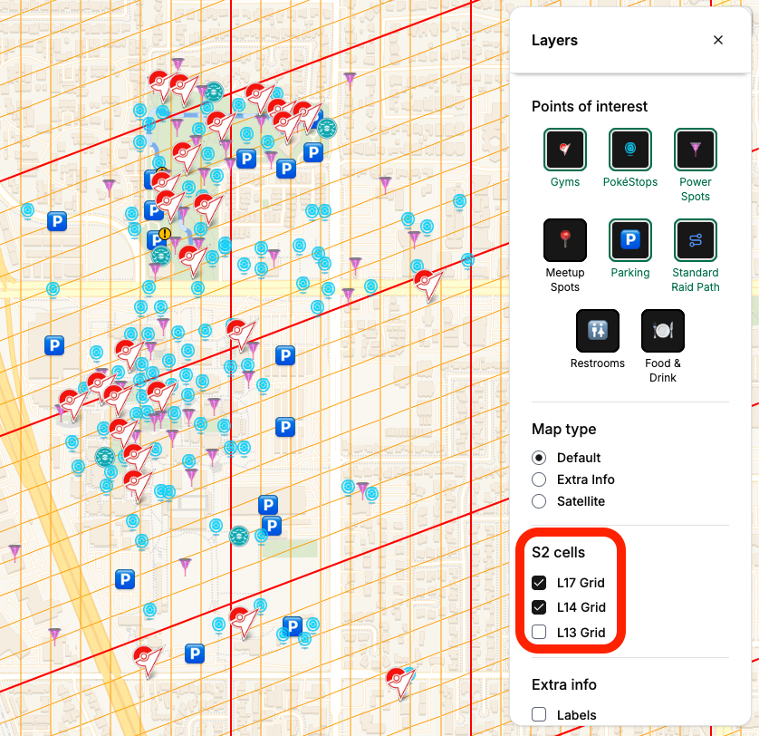
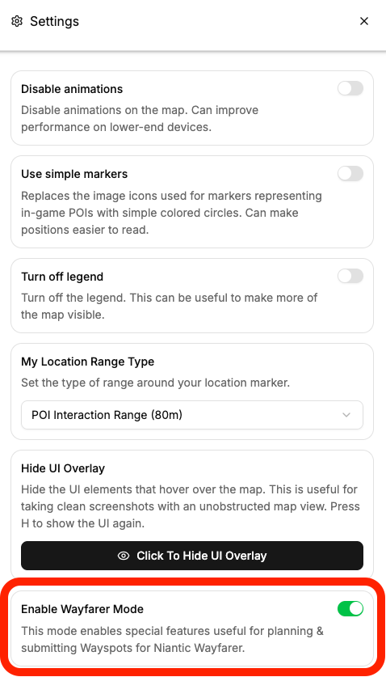
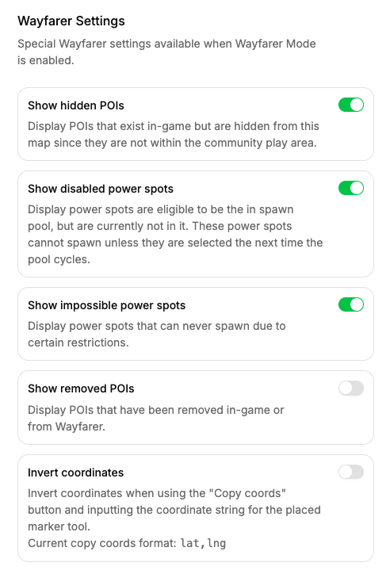
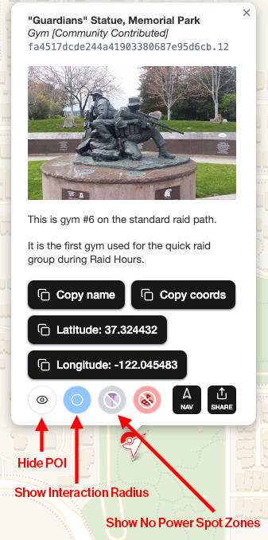
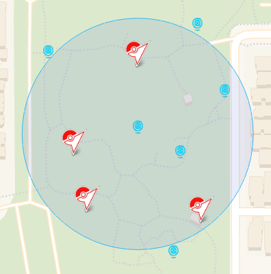
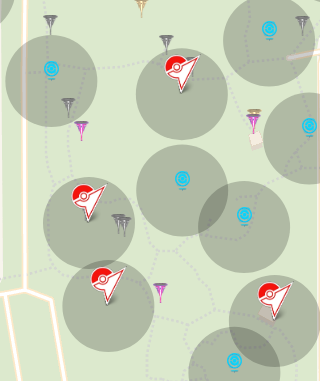
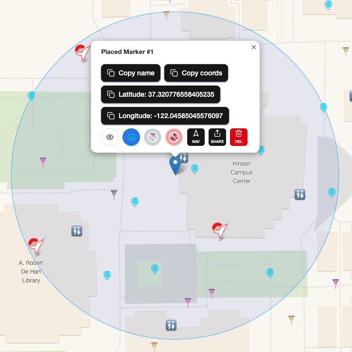
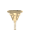
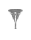

# Use With Niantic Wayfarer: Tips For Wayfinders

This project provides many useful features specifically for Wayfinders which is the term used for users of [Niantic Wayfarer](https://wayfarer.nianticlabs.com).

## Visualizing S2 Cells

If you open the layers panel, you can visualize the level 13, 14, and 17 S2 grids in the "S2 cells" section.

## Enabling Wayfarer Mode

In the settings, you can enable **Wayfarer Mode** which gives you access to special features specific to Wayfinders.

When enabled, the "Wayfarer Settings" section will appear in the settings screen.

**We recommend enabling "Show hidden POIs" and "Show disabled power spots" to get a complete, one-to-one overview of the current map data.**

Additionally, you will gain access to the following features:

- Buttons that will copy and paste various POI data to your clipboard.
- Ability to hide individual POIs from the map which can be revealed through the list & layer panels.
- Show the interaction radius for a specific POI which visualizes the 80m range in which the POI can be interacted with.
- Show the no Power Spot zone for a specific POI which visualizes the 22m range in which Power Spots cannot be built around PokéStops & Gyms.
- Show the no Community Ambassador POI zones which visualize the 30m range in which Community Campsite POIs cannot be built around other Wayfarer POIs.

To demonstrate some of these features, here is what the popup looks like once Wayfarer Mode is enabled:

The following screenshot shows an example of the interaction radius enabled for a specific PokéStop. The blue circle represents the 80-meter interaction range, meaning players can spin the PokéStop while they are within this area:

The following screenshot shows an example of no Power Spot zones enabled. The grey circles represent the 22-meter radius around Gyms and PokéStops where Wayspots are unable to become Enabled/Active Power Spots. [(In this project, we refer to these Wayspots as "Impossible Power Spots," which we explain in more detail here.)](#power-spot-terminology)

All of the grey Power Spots you see here are within the 22-meter grey circles which means they can never appear in-game as Active Power Spots unless conditions around them change.

## Placing Custom Markers

When you left-click on desktop or long press on mobile on an open area of the map, you can place a custom blue marker. This is useful for things like testing positions for nominations, visualizing what POIs are in the interactive radius, etc.

The following screenshot shows a placed marker with a popup open. You can click on the buttons to copy values like latitude and longitude, and you can access Wayfarer Mode features like the interaction radius, and more.

_We gotta flex the 13 PokéStops and 3 Gyms that are all spinnable at our [Campsite's meetup spot at De Anza College](https://www.cupertinopogo.com/map?id=hinson-meetup)!_

## Available Special Keywords When Searching In The List

The search feature supports the following keywords which can help filter the list:

- `gym` or `gyms`: List all Gyms.
- `pokestop` or `pokestops`: List all PokéStops.
- `showcase` or `showcases`: List all Showcase PokéStops.
- `powerspot` or `powerspots`: List all Power Spots.
- `devpoi`: List all dev POIs.
- `meetupspot` or `meetupspots`: List all meetup spots.
- `parking`: List all parking areas.
- `restroom` or `restrooms`: List all restrooms.

You can also combine these keywords together. For example, typing `gym pokestop restroom` will list all Gyms, PokéStops, and restrooms.

## Power Spot Terminology

Enabled/Disabled Power Spots are not official terms, but we use it to distinguish different types of Power Spots that people usually don't consider.

Most people are aware of **Active Power Spots** which are the Power Spots that appear in the in-game map and can spawn Pokémon for that given day.

Most people are also aware of **Inactive Power Spots** which are the Power Spots that appear in the in-game map but don't currently have a Pokémon spawned on it. Usually these appear the day before a Power Spot becomes active.

**Enabled Power Spots** are different in that they are Power Spots that are in the currently monthly spawn pool. That means for any given day, they have a chance to become Active Power Spots and spawn Pokémon.

**Disabled Power Spots** are Power Spots that are not in the current monthly spawn pool. That means for the given monthly time period, they can never become Active Power Spots. When the monthly rotation occurs, they do have a chance in becoming an Enabled Power Spot which in turn will allow them to possibly appear in the in-game map as an Active Power Spot during that month. These should not be confused with Inactive Power Spots.

**Impossible Power Spots** are Power Spots that can never become Enabled Power Spots. They can essentially never exist in-game unless the conditions around them are changed, but they do exist within Wayfarer. The most common reason for Impossible Power Spots to exist is when they are within 22-meters of a Gym or PokéStop.

By default, only Enabled Power Spots are shown. In order to view Disabled & Impossible Power Spots, you must enabled Wayfarer Mode and then turn them on through the Wayfarer Settings.

## Work With GeoJSON On Your Own

We've built our map data using [GeoJSON](https://geojson.org), an open standard format for geographic data. Because GeoJSON is widely supported, you can use our map data with many other applications and tools outside of this project.

For more information, read our ["Working With GeoJSON" document](./geojson.md).
